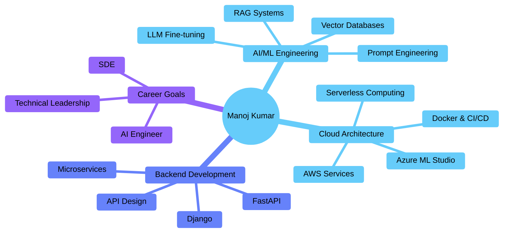

# 🚀 Manoj Kumar Pradhan | AI Engineer & Full-Stack Developer


<br/>

```python
class ManojKumarPradhan:
    def __init__(self):
        self.location = "🇮🇳 Bhopal, India"
        self.education = "Vellore Institute of Technology | CSE | CGPA: 8.33"
        self.role = "Bug Slayer & Chai Lover ☕"
        self.mission = "Building intelligent systems that bridge AI research and real-world impact"
        
        self.expertise = {
            "ai_ml": [
                "Generative AI", "LLM Integration", "RAG Systems",
                "LangChain", "Transformers", "LLM Fine-tuning"
            ],
            "cloud_backend": [
                "AWS", "Azure", "Docker", "CI/CD Pipelines", "FastAPI", "Django"
            ],
            "databases": [
                "PostgreSQL", "MongoDB", "MySQL",
                "Vector DBs (ChromaDB, Qdrant)"
            ],
            "tools": [
                "Selenium", "Web Scraping", "Kafka", "RabbitMQ",
                "Streamlit", "Grafana", "Postman"
            ]
        }
        
        self.languages = ["Python", "Java", "SQL"]
        
    def achievements(self):
        return {
            "hackathons": "🏆 Top 130 @ Amazon HackOn 2025",
            "dsa": "💻 200+ problems on LeetCode & GFG", 
            "impact": "⚡ Reduced HR decision time from 30min → 6min with RAG"
        }
    
    def what_drives_me(self):
        return "Translating cutting-edge AI research into production-ready systems"
    
    def call_to_action(self):
        return "Open to collaborations on AI/ML projects and new opportunities!"
```

<br/>


</div>

---

## 🛠️ Technology Arsenal

<div align="center">

### **AI/ML & Data Science**

<table>
<tr>
<td align="center" width="96">

<br><b>LangChain</b>
</td>
<td align="center" width="96">

<br><b>HuggingFace</b>
</td>
<td align="center" width="96">

<br><b>Transformers</b>
</td>

</tr>
</table>

### **Backend & Cloud Infrastructure**

<table>
<tr>
<td align="center" width="96">

<br><b>AWS</b>
</td>
<td align="center" width="96">

<br><b>Azure</b>
</td>
<td align="center" width="96">

<br><b>Docker</b>
</td>
<td align="center" width="96">

<br><b>FastAPI</b>
</td>
<td align="center" width="96">

<br><b>Django</b>
</td>

<td align="center" width="96">

<br><b>Git</b>
</td>
<td align="center" width="96">

<br><b>GitHub</b>
</td>
<td align="center" width="96">

<br><b>Postman</b>
</td>
<td align="center" width="96">

<br><b>Grafana</b>
</td>
<td align="center" width="96">

<br><b>Linux</b>
</td>
</tr>
</table>

### **Databases & Automation**

<table>
<tr>
<td align="center" width="96">

<br><b>PostgreSQL</b>
</td>
<td align="center" width="96">

<br><b>MongoDB</b>
</td>
<td align="center" width="96">

<br><b>Qdrant</b>
</td>
<td align="center" width="96">

<br><b>Selenium</b>
</td>
<td align="center" width="96">

<br><b>Streamlit</b>
</td>
<td align="center" width="96">

<br><b>Kafka</b>
</td>
</tr>
</table>

### **Languages & Tools**

<table>
<tr>
<td align="center" width="96">

<br><b>Python</b>
</td>
<td align="center" width="96">

<br><b>Java</b>
</td>
<td align="center" width="96">

<br><b>SQL</b>
</td>
</tr>
</table>

</div>

---

## 📊 GitHub Performance Metrics

<div align="center">


<br/><br/>


</div>

---

## 🏆 Achievements & Highlights

<div align="center">

[](https://github.com/manojkp08)

</div>

<br/>

<table>
<tr>
<td align="center">

<br/><b>Top 130</b>
<br/>Amazon HackOn 2025
</td>
<td align="center">

<br/><b>Top 100</b>
<br/>Deloitte Hacksplosion
</td>
<td align="center">

<br/><b>200+ Problems</b>
<br/>LeetCode & GFG
</td>
<td align="center">

<br/><b>OCI Certified</b>
<br/>Gen AI Professional
</td>
</tr>
</table>

---

## 🚀 Featured Projects

<div align="center">

<table>
<tr>
<td width="50%">

### 🎯 **TalentLens - AI-Powered HR Automation**


**RAG system matching job descriptions to assessments**

**Impact:**
- ⚡ 80% faster decisions (30min → 6min)
- 🎯 High accuracy with Sentence-Transformers
- 📈 Scaled to 200+ users (<20s latency)

**Tech:** RAG, Vector Search, FastAPI, Streamlit

[View Project →](https://github.com/manojkp08)

</td>
<td width="50%">

### 🤖 **SubRedditorX - Reddit Automation Bot**


**Intelligent Reddit posting automation system**

**Impact:**
- 🚀 94% time reduction (5min → 45sec)
- 📚 Compliant across 50+ communities
- 🏗️ Modular architecture for rapid features

**Tech:** Selenium, Appium, Gemini AI, MongoDB

[View Project →](https://github.com/manojkp08)

</td>
</tr>
<tr>
<td width="50%">

### 🔍 **NexAI - Automated Market Research**


**Multi-agent AI system for market intelligence**

**Impact:**
- 📊 15,000+ company insights across 8 industries
- ⚡ 3× efficiency improvement
- 🐳 Dockerized for seamless deployment

**Tech:** Cohere API, Web Scraping, Docker, Streamlit

[View Project →](https://github.com/manojkp08)

</td>
<td width="50%">

### 🏥 **Amazon HackOn 2025 - AI Safety System**


**AI-powered safety monitoring solution**

**Achievement:**
- 🏆 Top 130 teams across India
- 🔒 Real-time safety monitoring
- ☁️ AWS cloud architecture

**Tech:** AWS Services, ML Models, Real-time Processing

[View Details →](https://github.com/manojkp08)

</td>
</tr>
</table>

</div>

---

## 🎯 Current Focus



---

## 💼 Professional Experience

<table>
<tr>
<td>

### 🤖 **AI Trainer @ Outlier AI** (Remote)
**Nov 2024 - Jun 2025**

- Evaluating 100+ AI code samples weekly for quality & best practices
- Contributing Java & Python expertise to improve model performance
- Focus on accuracy, performance optimization, and coding standards

</td>
</tr>
</table>

---

## 📜 Certifications

<div align="center">

<table>
<tr>
<td align="center" width="33%">

<br/><br/>
<b>Oracle Cloud Infrastructure 2025</b>
<br/>Generative AI Professional
<br/><br/>
<a href="https://drive.google.com/file/d/1xmU_RcEiMK5Ai7ULhNPZqMxuFs6gD39q/view">View Certificate →</a>
<br/><br/>
<a href="https://catalog-education.oracle.com/pls/certview/sharebadge?id=C9D43BB925BACD6E521EA3C5E01688AB4A94F1BAA644DBD6624B33FCF8DF38B2">Verify through Oracle Certview →</a>
</td>
<td align="center" width="33%">

<br/><br/>
<b>Cloud Computing</b>
<br/>NPTEL - IIT
<br/><br/>
<a href="https://drive.google.com/file/d/169c1EeWolW_gk2Cn7-V0zwdS6t3m5963/view">View Certificate →</a>
</td>
<td align="center" width="33%">

<br/><br/>
<b>Computer Networking</b>
<br/>Google via Coursera
<br/><br/>
<a href="https://www.coursera.org/account/accomplishments/verify/87XT3TJE7QKJ">View Certificate →</a>
</td>
</tr>
</table>

</div>

---

## 💼 Open to Opportunities

<div align="center">

### 🎯 **Looking For**

<table>
<tr>
<td align="center" width="33%">

<br/><br/>
<b>SDE Roles</b>
<br/>Full-time positions 
<br/>
</td>
<td align="center" width="33%">

<br/><br/>
<b>AI Engineer Positions</b>
<br/>RAG systems, LLM integration
<br/>Production ML & Generative AI
</td>
<td align="center" width="33%">

<br/><br/>
<b>Open Source</b>
<br/>AI/ML projects & tools
<br/>Cloud infrastructure & automation
</td>
</tr>
</table>

### 📬 **Let's Connect!**

<br/>

[](https://www.linkedin.com/in/devdreamerx)
[](mailto:manojkprdev@gmail.com)

</div>

---

## 📈 Development Activity

<div align="center">


</div>

---

## 🐍 Contribution Snake

<picture>
  <source media="(prefers-color-scheme: dark)" srcset="https://raw.githubusercontent.com/manojkp08/manojkp08/output/github-snake-dark.svg">
  <source media="(prefers-color-scheme: light)" srcset="https://raw.githubusercontent.com/manojkp08/manojkp08/output/github-snake.svg">
  
</picture>

---

<div align="center">

### 💭 Developer Wisdom


---

### 🌟 Key Metrics

<table>
<tr>
<td align="center">
<b>200+</b><br/>DSA Problems Solved
</td>
<td align="center">
<b>80%</b><br/>Efficiency Improvement
</td>
<td align="center">
<b>15K+</b><br/>Data Points Collected
</td>
<td align="center">
<b>Top 130</b><br/>Amazon HackOn 2025
</td>
</tr>
</table>

---

**✨ "The best way to predict the future is to build it." - Alan Kay**

<br/>


**Made with ❤️ by Manoj**

</div>
