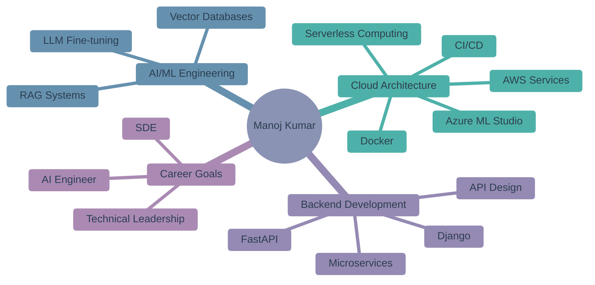

</div>

<br/>

```python
class ManojKumarPradhan:
    def __init__(self):
        self.location = "India"
        self.education = "Vellore Institute of Technology | CSE | CGPA: 8.33"
        self.role = "Bug Slayer & Chai Lover ☕"
        self.mission = "Building intelligent systems that bridge AI research and real-world impact"
        
        self.expertise = {
            "ai_ml": [
                "Generative AI", "LLM Integration", "RAG Systems",
                "LangChain", "Transformers", "LLM Fine-tuning"
            ],
            "cloud_backend": [
                "AWS", "Azure", "Docker", "CI/CD Pipelines", "FastAPI", "Django"
            ],
            "databases": [
                "PostgreSQL", "MongoDB", "MySQL",
                "Vector DBs (ChromaDB, Qdrant)"
            ],
            "tools": [
                "Selenium", "Web Scraping", "Kafka", "RabbitMQ",
                "Streamlit", "Grafana", "Postman"
            ]
        }
        
        self.languages = ["Python", "Java", "SQL"]
    
    def what_drives_me(self):
        return "Translating cutting-edge AI research into production-ready systems"
    
    def call_to_action(self):
        return "Open to collaborations on AI/ML projects and new opportunities!"
```

<br/>
<div align="center">
    
#### Joke 😂

</div>
<div align="center">

</div>


<br/>

<div align="center">

# 🚀 Tech Stack

</div>

<div align="center">

### 🤖 AI/ML & Data Science

<p>
  <a href="https://www.langchain.com/" target="_blank">
    
  </a>
  &nbsp;&nbsp;&nbsp;
  <a href="https://huggingface.co/" target="_blank">
    
  </a>
  &nbsp;&nbsp;&nbsp;
  <a href="https://www.tensorflow.org/" target="_blank">
    
  </a>
</p>

</div>

<br/>

<div align="center">

### ☁️ Backend & Cloud Infrastructure

<p>
  <a href="https://aws.amazon.com/" target="_blank">
    
  </a>
  &nbsp;&nbsp;
  <a href="https://azure.microsoft.com/" target="_blank">
    
  </a>
  &nbsp;&nbsp;
  <a href="https://www.docker.com/" target="_blank">
    
  </a>
  &nbsp;&nbsp;
  <a href="https://fastapi.tiangolo.com/" target="_blank">
    
  </a>
  &nbsp;&nbsp;
  <a href="https://www.djangoproject.com/" target="_blank">
    
  </a>
</p>

<p>
  <a href="https://git-scm.com/" target="_blank">
    
  </a>
  &nbsp;&nbsp;
  <a href="https://github.com/" target="_blank">
    
  </a>
  &nbsp;&nbsp;
  <a href="https://www.postman.com/" target="_blank">
    
  </a>
  &nbsp;&nbsp;
  <a href="https://grafana.com/" target="_blank">
    
  </a>
  &nbsp;&nbsp;
  <a href="https://www.linux.org/" target="_blank">
    
  </a>
</p>

</div>

<br/>

<div align="center">

### 💾 Databases & Automation

<p>
  <a href="https://www.postgresql.org/" target="_blank">
    
  </a>
  &nbsp;&nbsp;&nbsp;
  <a href="https://www.mongodb.com/" target="_blank">
    
  </a>
  &nbsp;&nbsp;&nbsp;
  <a href="https://qdrant.tech/" target="_blank">
    
  </a>
  &nbsp;&nbsp;&nbsp;
  <a href="https://www.selenium.dev/" target="_blank">
    
  </a>
  &nbsp;&nbsp;&nbsp;
  <a href="https://streamlit.io/" target="_blank">
    
  </a>
  &nbsp;&nbsp;&nbsp;
  <a href="https://kafka.apache.org/" target="_blank">
    
  </a>
</p>

</div>

<br/>

<div align="center">

### 💻 Core Languages

<p>
  <a href="https://www.python.org/" target="_blank">
    
  </a>
  &nbsp;&nbsp;&nbsp;&nbsp;
  <a href="https://www.java.com/" target="_blank">
    
  </a>
  &nbsp;&nbsp;&nbsp;&nbsp;
  <a href="https://www.w3schools.com/sql/" target="_blank">
    
  </a>
</p>

</div>

> [!NOTE]
> 💡 Click on any icon to explore the technology!</sub>

<br/>
<br/>

---

<br/>

<div align="center">

# 📊 GitHub Performance Metrics

<table>
<tr>
<td width="50%" align="center">

</td>
<td width="50%" align="center">

</td>
</tr>
</table>


<table>
<tr>
<td width="50%" align="center">

</td>
<td width="50%" align="center">

</td>
</tr>
</table>


</div>

<br/>

<div align="center">

### 🏆 Achievements & Highlights

[](https://github.com/ryo-ma/github-profile-trophy)


</div>

<br/>
<br/>

---

<br/>

## 🎯 Current Focus

<div align="center">



</div>

<br/>
<br/>

---

<br/>

## 💼 Professional Experience

<div align="center">

<table>
<tr>
<td>

### 🤖 **AI Trainer @ Outlier AI** (Remote)
**Nov 2024 - Jun 2025**

- Evaluating 100+ AI code samples weekly for quality & best practices
- Contributing Java & Python expertise to improve model performance
- Focus on accuracy, performance optimization, and coding standards

</td>
</tr>
</table>

</div>

<br/>
<br/>

---

<br/>

## 📜 Certifications

<div align="center">

<table>
<tr>
<td align="center" width="33%">

<br/><br/>
<b>Oracle Cloud Infrastructure 2025</b>
<br/>Generative AI Professional
<br/><br/>
<a href="https://drive.google.com/file/d/1xmU_RcEiMK5Ai7ULhNPZqMxuFs6gD39q/view">View Certificate →</a>
<br/><br/>
<a href="https://catalog-education.oracle.com/pls/certview/sharebadge?id=C9D43BB925BACD6E521EA3C5E01688AB4A94F1BAA644DBD6624B33FCF8DF38B2">Verify through Oracle Certview →</a>
</td>
<td align="center" width="33%">

<br/><br/>
<b>Cloud Computing</b>
<br/>NPTEL - IIT
<br/><br/>
<a href="https://drive.google.com/file/d/169c1EeWolW_gk2Cn7-V0zwdS6t3m5963/view">View Certificate →</a>
</td>
<td align="center" width="33%">

<br/><br/>
<b>Computer Networking</b>
<br/>Google via Coursera
<br/><br/>
<a href="https://www.coursera.org/account/accomplishments/verify/87XT3TJE7QKJ">View Certificate →</a>
</td>
</tr>
</table>

</div>

<br/>
<br/>

---

<br/>

## 💼 Open to Opportunities

<div align="center">

### 🎯 **Looking For**

<table>
<tr>
<td align="center" width="33%">

<br/><br/>
<b>SDE Roles</b>
<br/>Full-time positions 
<br/>
</td>
<td align="center" width="33%">

<br/><br/>
<b>AI Engineer Positions</b>
<br/>RAG systems, LLM integration
<br/>Production ML & Generative AI
</td>
<td align="center" width="33%">

<br/><br/>
<b>Open Source</b>
<br/>AI/ML projects & tools
<br/>Cloud infrastructure & automation
</td>
</tr>
</table>

### 📬 **Let's Connect!**

<br/>

[](https://www.linkedin.com/in/devdreamerx)
[](mailto:manojkprdev@gmail.com)

</div>

<br/>
<br/>

---

<br/>

<div align="center">

## 🐍 Contribution Snake

<picture>
  <source media="(prefers-color-scheme: dark)" srcset="https://raw.githubusercontent.com/manojkp08/manojkp08/output/github-snake-dark.svg">
  <source media="(prefers-color-scheme: light)" srcset="https://raw.githubusercontent.com/manojkp08/manojkp08/output/github-snake.svg">
  
</picture>

</div>

<br/>
<br/>

---

<br/>

<div align="center">

### 💭 Developer Wisdom


</div>

<br/>


<div align="center">

<br/>


**Made with ❤️ by Manoj**

</div>

<br>
